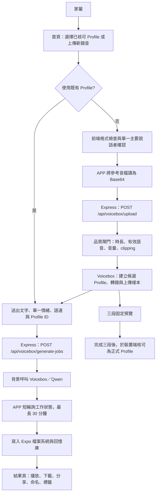

# EchoAPP 專案架構總覽與核心檔案索引

> 本文件供新 AI、開發者與維護人員快速建立全局理解。它描述目前實作，而非未來的目標架構；後續規劃請同時閱讀 [`todo.md`](../todo.md) 與 [`SELF_HOSTED_VOICE_SERVICE_ARCHITECTURE.md`](SELF_HOSTED_VOICE_SERVICE_ARCHITECTURE.md)。

## 1. 專案定位與執行邊界

**迴響（EchoAPP）**是以 React Native／Expo 製作的行動式語音克隆介面。家屬上傳具有使用授權的親友錄音，輸入欲生成的文字，系統透過 Windows 電腦上的本機 Voicebox 與 Qwen 引擎合成語音。APP 本身不在雲端執行模型；Cloudflare Named Tunnel 僅提供固定的 HTTPS 傳輸入口。

| 邊界 | 現況 | 維護意義 |
|---|---|---|
| 行動 APP | Expo SDK 54、React Native、TypeScript、Expo Router | 負責選檔、品質確認、Profile 選取、生成狀態、播放、下載與本機回憶庫。 |
| APP 後端 | Express、tRPC、Drizzle ORM | 對 APP 提供 Voicebox 代理與背景生成任務 API；目前主要語音資料流使用 REST。 |
| 語音推論 | Windows 本機 Voicebox、Qwen 1.7B Base、Whisper Large | 建立 Profile、轉錄參考音檔、產生語音。模型、Profile 與授權音檔不在 GitHub。 |
| 對外傳輸 | Cloudflare Named Tunnel | 固定網址 `https://voicebox.echo-voice.cc` 轉送至 Windows 的 `localhost:17493`。 |
| APP 本機保存 | AsyncStorage 與 Expo FileSystem | 保存回憶庫、核可／候選 Profile 狀態與已生成音檔路徑；不會自動跨裝置同步。 |

## 2. 目前資料流



生成工作刻意改為「建立工作後立即回應，再由 APP 短輪詢」；此舉用來避開 CPU 推論較久時，被 Tunnel 或中介層中斷長連線而誤報 HTTP 504 的問題。伺服器端工作紀錄目前保存在記憶體中，保存期限為 30 分鐘；若 API 伺服器重啟，未完成工作在 APP 端可能顯示為找不到工作，這是已知限制。

## 3. 目錄與核心檔案

| 路徑 | 角色 | 修改時需注意 |
|---|---|---|
| `app/_layout.tsx` | 全域 Provider、通知初始化、啟動畫面、全域浮動生成元件與主 Stack。 | 新增全域 Provider、全域通知或路由時由此掛載。 |
| `app/(tabs)/index.tsx` | 首頁主流程：上傳、已核可 Profile 選擇、單一情緒、語速、候選預覽與核可。 | 選擇既有 Profile 時必須清除新音檔狀態；上傳新音檔時必須解除既有 Profile 選擇。 |
| `app/result.tsx` | 單筆生成結果：圓形播放、下載、分享、命名、標籤與保存。 | 顯示使用者原始正字，勿顯示為合成而用的同音代理字。 |
| `app/(tabs)/history.tsx` | 本機回憶庫：搜尋、標籤篩選、播放、編輯、下載及分享。 | 歷史資料來自 AsyncStorage，資料結構變動需處理舊紀錄相容性。 |
| `lib/voice-service.ts` | APP 語音核心：讀取音檔、Base64 上傳、工作建立與輪詢、結果寫檔、歷史保存。 | `generateSpeech()` 是最關鍵資料流；勿把長推論改回單一同步 HTTP 請求。 |
| `lib/generation-store.ts` | 模組級生成狀態，讓使用者離開首頁後仍可看到進度與完成／錯誤通知。 | 必須保留 `start → update → complete/fail → reset` 生命週期，避免元件內局部 state 取代。 |
| `lib/voice-profile-store.ts` | 在裝置端保存候選與核可 Profile、來源音檔名稱、參考文字與三段預覽完成紀錄。 | Voicebox 不知道「核可」狀態；該狀態目前是**每台裝置**的 AsyncStorage。 |
| `lib/pinyin-helpers.ts` | 強制讀音：同音代理字與 `字(注音)` 標記解析。 | 只可改變送給合成器的文字；結果頁與回憶庫永遠顯示原始正字。 |
| `server/_core/index.ts` | Express 啟動點與 `/api/voicebox/*` 契約；建立背景工作、保存結果、回傳狀態。 | `voiceboxGenerationJobs` 是暫存 Map；若改成持久佇列，先保留現有端點與工作狀態形狀。 |
| `server/voicebox.ts` | Voicebox API 適配、ffmpeg／ffprobe 音檔分析、Whisper 轉錄、Profile 建立、504 復原。 | 禁止對 Profile 建立 POST 盲目重試；服務已接受請求但回應中斷時會造成重複／空白 Profile。 |
| `tests/pinyin-helpers.test.ts` | 中文強制讀音規則測試。 | 新增詞庫或改變注音解析，必須補對應案例。 |
| `tests/reference-audio-quality.test.ts` | 參考音檔品質拒絕規則測試。 | 門檻若有調整，需確認訊息仍能引導家屬提供更佳素材。 |
| `tests/voice-profile-store.test.ts` | 候選／核可 Profile 合併與排序規則。 | 不得讓新候選版本覆蓋已核可的最佳 Profile。 |
| `docs/` | 服務、搬遷、品質與架構的正式文件。 | 調整流程、環境或資料保存邊界時，必須同步更新相應文件。 |

## 4. Voicebox 後端 API 契約

| 方法與端點 | 請求重點 | 回應／用途 |
|---|---|---|
| `GET /api/voicebox/health` | 無 | 回報 Voicebox 線上狀態、網址與 Profile 數量。 |
| `GET /api/voicebox/profiles` | 無 | 回傳 Voicebox Profile 摘要；候選／核可狀態由 APP 再自行合併。 |
| `POST /api/voicebox/upload` | `name`、`audioBase64`、`mimeType`、可選 `referenceText`、`personality`、`description` | 先執行品質閘門，再建立 Voicebox Profile 並上傳樣本；品質不合格回傳 HTTP 422。 |
| `POST /api/voicebox/generate` | `text`、`profileId`、語速、語言、指令與引擎 | 同步相容端點；新流程應優先使用工作端點。 |
| `POST /api/voicebox/generate-jobs` | 與同步生成端點相同 | 立即回傳 `jobId` 與 `queued` 狀態，後台開始合成。 |
| `GET /api/voicebox/generate-jobs/:jobId` | 工作 ID | 回傳 `queued`、`generating`、`completed` 或 `failed`；完成時附 Base64 音檔與時長。 |

## 5. 已落地的聲音品質規則

| 控制點 | 目前實作 | 原因 |
|---|---|---|
| 已核可 Profile 重用 | 首頁可載入既有 Voicebox Profile；選定後生成不再要求重新上傳參考音檔。 | 避免每次新建 Profile 造成音色漂移與重複等待。 |
| 候選版本保護 | 新錄音建立候選 Profile，不覆蓋既有核可 Profile。 | 保護已被家屬接受的最佳聲音。 |
| 品質拒絕 | 建立 Profile 前檢查總時長至少 20 秒、有效語音至少 15 秒、平均音量不低於 -42 dB、峰值不可達 clipping 門檻。 | 在模型建立聲音身份前攔截明顯不適合的樣本。 |
| 單人確認 | 上傳新檔後，必須由使用者確認主要只有一位親友說話。 | 目前尚未實作自動說話者分離，避免多人對話混入。 |
| 三段預覽 | 日常、關懷與專名／特殊讀音三段完成後，候選 Profile 才能被核可。 | 以固定條件檢核音色、情緒與專有名詞。 |
| 中文強制讀音 | 支援同音代理字詞庫與 `字(注音)` 覆寫。 | 降低人名與罕用字被錯讀的機率。 |

## 6. 開發與驗證指令

```bash
pnpm install
pnpm test
pnpm check
pnpm dev
```

測試與 TypeScript 檢查通過不等於已驗證 Windows 模型生成品質。涉及 Voicebox 的修改，仍需使用**已授權測試音檔**在 Windows 主機上完成「建立候選 → 三段預覽 → 核可／不核可 → 正式生成」的端對端驗證。

## 7. 不在 GitHub 的必要狀態

下列資料必須透過安全備份與搬遷流程維護，不能假定 `git clone` 後會自動存在：Windows 上的 Voicebox 安裝與模型快取、Voicebox Profile 資料、家屬授權音檔、`.env` 內容、Cloudflare Tunnel 憑證、Windows Service 設定與 APP 裝置上的 AsyncStorage／已生成音檔。詳細步驟請參閱 [`MIGRATION_GUIDE.md`](MIGRATION_GUIDE.md) 與 [`WINDOWS_NEW_PC_TUNNEL_SETUP.md`](WINDOWS_NEW_PC_TUNNEL_SETUP.md)。
