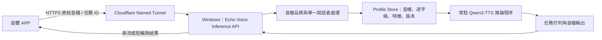

# 迴響自建本機語音克隆服務與低延遲架構藍圖

> **結論：可行，但不建議從零訓練一個語音大模型。**最務實的作法是以具商用友善授權的開源模型為核心，在既有 Windows 電腦上建立「迴響推論服務」。服務自行保存已處理的參考音檔、逐字稿與說話者特徵，並提供簡潔的上傳、核可與生成介面。現有 Voicebox 應持續作為正式服務，新的服務僅以獨立埠與獨立資料夾進行旁路驗證。

## 一、為何目前流程感覺卡頓

目前流程包含 APP 將參考音檔轉為 Base64、傳至中介 API、再經固定 Tunnel 送至 Windows Voicebox；生成時再經背景任務輪詢取得 Base64 音檔，最後由 APP 寫回本機檔案。這種設計可靠地避開長連線逾時，但每次新建 Profile 都有多次資料複製與 HTTP 往返。

Base64 並非原始二進位傳輸；其編碼以四個字元表達三個原始位元組，因此有效載荷通常較原始檔案增加約三分之一。[6] 當音檔較長或網路不穩定時，這會放大等待感。更重要的是，CPU 上的聲音特徵分析與合成仍是主要耗時來源；**改成自建服務可以減少傳輸與重複前處理，但不能讓 CPU 的模型推論憑空變快。**

| 現況步驟 | 造成等待的原因 | 自建服務的改善方式 |
|---|---|---|
| APP 將音檔轉為 Base64 | 編碼、記憶體複製與較大請求內容 | 改為 `multipart/form-data` 原始音檔上傳 |
| 中介 API 再轉送到 Voicebox | 多一次網路往返與逾時風險 | APP 直連同一台 Windows 主機上的自有 API；Tunnel 仍只負責安全傳輸 |
| 每次生成重新讀取參考音檔 | 重複做說話者特徵／提示特徵處理 | 已核可 Profile 僅在初次建立時提取特徵，後續直接重用 |
| 長時間同步回應 | Cloudflare 與行動網路可能中斷 | 保留任務 ID、短輪詢與「完成後下載」機制；若模型支援，再加入音訊串流 |

## 二、自建服務不是重新發明模型

「自行製作像 Voicebox 的 AI」應拆成兩層。第一層是**可重用的開源模型**，負責聲音特徵與語音合成；第二層是**迴響自有服務層**，負責家屬授權、音檔清理、說話者片段、Profile 版本、品質驗收、任務佇列與 APP 介面。後者才是迴響可長期累積、且能直接解決家屬體驗的能力。

Qwen3-TTS Base 支援以參考音檔與其正確逐字稿進行聲音克隆，並提供建立後可重用的 `voice_clone_prompt`，避免每次合成都重新計算提示特徵。[1] 因此，現有「已核可 Profile 重用」機制可自然延伸為自有服務內的已快取聲音特徵，而非只保存一個外部 Profile ID。

## 三、候選模型的實務比較

| 模型／專案 | 中文與克隆能力 | 授權重點 | 對迴響的實務意義 |
|---|---|---|---|
| **Qwen3-TTS 1.7B Base** | 官方提供中文與零樣本克隆；參考音檔加逐字稿可建立可重用提示特徵。[1] | Apache-2.0。[1] | **最符合現有 Qwen／Voicebox 經驗的首選。**先把它以自有服務封裝，而不是更換模型。 |
| **CosyVoice 3 0.5B** | 支援中文、臺語／閩南語等多種口音、零樣本克隆、拼音修補與雙向串流。[2] | Apache-2.0。[2] | 適合作為日後的獨立對照組，尤其可驗證臺灣口吻與串流回應；不要直接取代正式引擎。 |
| **GPT-SoVITS** | 原生中文工具鏈，5 秒零樣本與約 1 分鐘少樣本微調流程；提供 API 與 Windows 說明。[3] | 程式碼為 MIT；仍須逐一核對下載的權重授權。[3] | 適合需要「為同一位已授權親友建立較固定聲線」的研究型候選；維運與前處理較重。 |
| **OpenVoice V2** | 支援中文、即時音色克隆與風格控制。[4] | MIT，官方宣告可商用。[4] | 架構較輕，適合作為音色轉換對照；不應在未用相同語料實測前承諾優於 Qwen。 |
| **Fish Speech S2 Pro** | 官方列中文為核心支援，主打高擬真與細緻情緒標籤。[5] | Fish Audio Research License，非一般自由商用授權。[5] | **不應作為商業正式服務候選**，除非另行取得符合用途的書面授權。 |

## 四、建議的迴響本機服務架構

自有服務應由一個常駐的 Python 推論程序載入模型，另一個輕量 API 層管理傳輸與工作排程。模型不應隨每個請求重新載入；每位已核可親友建立 Profile 時，服務應保存以下資料：原始授權音檔指紋、裁切後單人片段、人工確認的參考逐字稿、品質分數、Qwen 的可重用提示特徵、建立時間與核可版本。

| 自有 API | 請求內容 | 服務端工作 | 回應 |
|---|---|---|---|
| `POST /v1/profiles` | 原始音檔、參考文字、聲音描述 | 格式正規化、品質閘門、人工單人確認、提示特徵建立 | `profileId`、品質結果、候選狀態 |
| `POST /v1/profiles/{id}/previews` | 三段固定驗收文字 | 重用候選特徵合成三段預覽 | 三個工作 ID 或音檔 URL |
| `POST /v1/profiles/{id}/approve` | 家屬核可動作 | 將候選版本標示為唯一正式版本 | 核可後 Profile 摘要 |
| `POST /v1/generations` | `profileId`、文字、單一情緒、語速 | 以已核可特徵合成；寫入工作佇列 | `jobId` |
| `GET /v1/generations/{jobId}` | 工作 ID | 讀取狀態與已完成音檔 | 狀態、進度、下載 URL |

## 五、低延遲改造的優先順序

### 第 1 步：先優化目前 Voicebox 使用方式

這是現在應優先完成的方向。已核可 Profile 直接重用，避免每次上傳重新建立聲音身份；參考文字必須和音檔逐字相符；新音檔只建立候選版本，且通過三段預覽才可成為正式版本。這些規則會立即降低品質漂移，且不需要更換模型。

### 第 2 步：建立獨立的「迴響推論服務」測試環境

在 Windows 電腦建立**完全獨立**的 Python 環境、模型資料夾、資料庫與 API 埠，例如 `17494`。這個服務只使用授權測試音檔，仍由另一條 Tunnel 子網域傳輸。原本 `17493` Voicebox、其 Profile 和正式 APP 路徑都不修改。此階段的第一個目標是證明：已快取的聲音特徵能否減少重複處理，並確認 Windows 主機的 GPU 型號、顯示卡記憶體與 CPU-only 時的實際生成時間。

### 第 3 步：用同一組驗收語料進行盲測

每個候選服務都必須使用**同一份已授權參考音檔、同一份人工校正逐字稿、同一組三段驗收文字、同一個情緒與語速設定**。家屬或內部人員再以不標示引擎的方式評分音色相似度、中文讀音、自然度、情緒與等待時間。未通過既有 Voicebox 基準者，不接入 APP。

### 第 4 步：只有在結果較佳時才增加 APP 的引擎選項

自有服務通過盲測後，才在後端加入可切換的「引擎適配器」。APP 繼續呼叫同一組 `Profile` 和 `Generation` API，不直接知道底層模型名稱；如此可讓 Voicebox 與新服務並行，同時保留可立即回退的路徑。

## 六、硬體與營運現實

若 Windows 主機僅以 CPU 推論，自建服務可減少上傳與重複特徵處理，但長句合成仍可能需要數分鐘。若主機具備相容的 NVIDIA GPU，讓模型常駐於 GPU、快取每個已核可 Profile 的提示特徵、並採取單一工作佇列，通常才是讓等待感明顯下降的關鍵。Qwen 官方示例使用 CUDA 和低精度設定，並建議相容硬體可採 FlashAttention 2 降低 GPU 記憶體使用；CosyVoice 官方則提供 FastAPI／gRPC 與 GPU 容器部署範例。[1] [2]

系統必須遵守以下營運原則：只處理取得授權的聲音、Profile 與音檔均依家屬工作區隔離、絕不以新候選樣本覆蓋正式版本、保留刪除與匯出機制、以及將 API 驗證與速率限制置於 Tunnel 後方。Cloudflare Tunnel 仍然有價值：它提供固定、安全的傳輸入口；改造目標是把**模型與 Profile 管理掌握在您的 Windows 主機上**，而不是取消必要的網路安全層。

## 七、現在最務實的結論

| 問題 | 回答 |
|---|---|
| 能不能自己做？ | **能。**應自建服務層並重用開源模型，不從零訓練基礎模型。 |
| 會不會更快？ | 可減少 Base64、中介轉送、重複特徵處理與模型冷啟動；真正的生成時間仍取決於硬體，尤其是否有 NVIDIA GPU。 |
| 要立刻換掉 Voicebox 嗎？ | **不要。**Voicebox 維持正式服務；新服務在獨立埠、獨立模型資料夾與授權測試素材下旁路驗證。 |
| 現在應先做什麼？ | 先量測 Windows 主機硬體與既有 Voicebox 三段生成時間；再建立不接 APP 的 `17494` 測試服務。 |

## References

[1] [Qwen3-TTS 官方 GitHub](https://github.com/QwenLM/Qwen3-TTS)

[2] [CosyVoice 官方 GitHub](https://github.com/FunAudioLLM/CosyVoice)

[3] [GPT-SoVITS 官方 GitHub](https://github.com/RVC-Boss/GPT-SoVITS)

[4] [OpenVoice 官方 GitHub](https://github.com/myshell-ai/OpenVoice)

[5] [Fish Speech 官方 GitHub](https://github.com/fishaudio/fish-speech)

[6] [RFC 4648：Base-N Encodings](https://www.rfc-editor.org/rfc/rfc4648)
